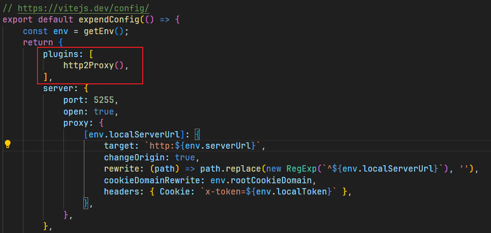

# vite-plugin-http2Proxy

An easy to use plugin to solve the problem that vite does not support http2Proxy.

# Feature

- Ease of use: no need to modify & compatible with `viteConfig.server.proxy` configuration, no need to learn new configuration
- Simple: https certificate is injected into the machine with `devcert` with one click, no additional operations
- Popular: Support for the latest 'vite'[^5.0.0]

# How to use

